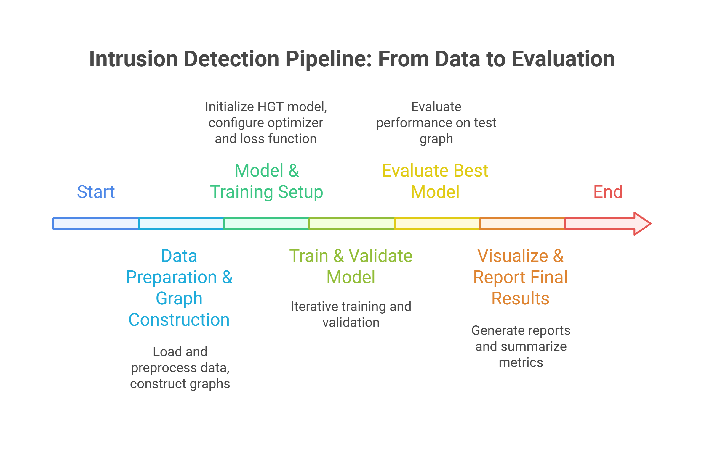
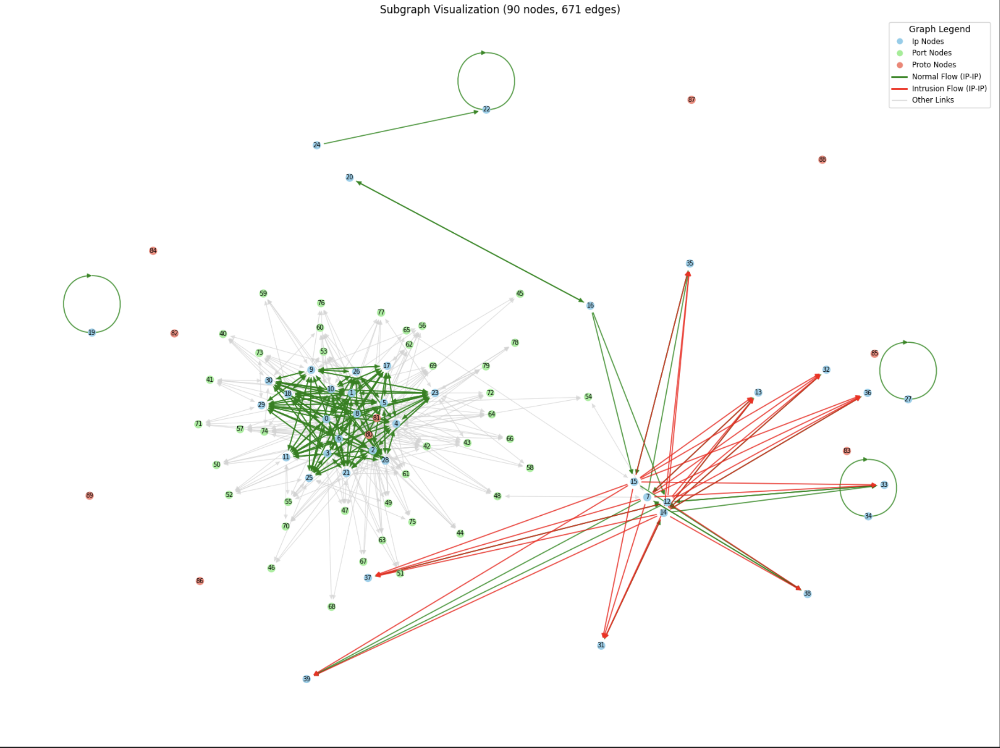
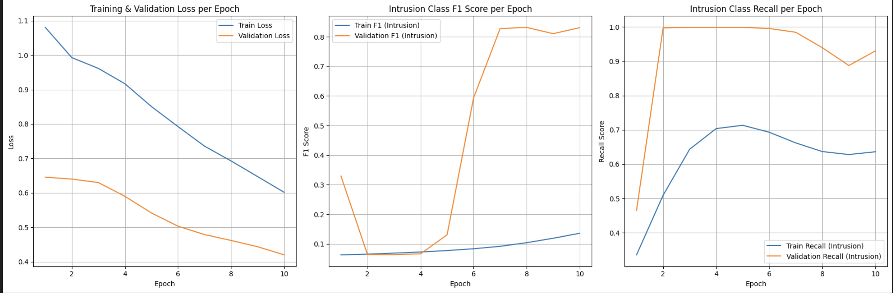

# Graph-NIDS: Detecting Network Intrusions via HGT-based Edge Classification on Network Traffic Graphs

<div align="center">
</div>

This repository contains the official implementation for **Graph-NIDS**, a novel Network Intrusion Detection System (NIDS). This project leverages the power of Graph Neural Networks (GNNs), specifically the **Heterogeneous Graph Transformer (HGT)**, to perform edge classification on network traffic graphs, effectively identifying malicious activities.

---

## 📜 Overview
The core objective of this research is to re-frame the network intrusion detection problem from a graph-based perspective. By modeling network traffic data from the **UNSW-NB15** dataset as a large, heterogeneous graph, we can effectively capture the complex relationships between IP addresses, ports, and protocols. An **HGT model** is then trained to perform edge classification, discerning whether a given network flow (an edge between two IP address nodes) is **benign ('Normal')** or an **'Intrusion'**.

---

## ⚙️ Workflow
The end-to-end workflow of the system, from data preprocessing to model evaluation, is illustrated below:



---

## ✨ Key Features
- **Heterogeneous Graph Construction**: Builds a rich graph structure with multiple node types (`ip`, `port`, `proto`) and edge types to represent diverse network interactions.
- **Heterogeneous Graph Transformer (HGT)**: Employs the state-of-the-art HGT architecture designed for handling complex, heterogeneous graphs.
- **Edge Classification Task**: Frames intrusion detection as an edge classification problem, classifying network flows between `ip` nodes as 'Normal' or 'Intrusion'.
- **Comprehensive Data Processing**: Includes robust scripts for sampling, stratification, and preprocessing of the UNSW-NB15 dataset.

---

## 🔬 Methodology
### 1. Preprocessing
- Raw network flow records from UNSW-NB15 undergo rigorous preprocessing.
- Categorical features (`proto`, `service`, `state`) are encoded.
- Numerical features are normalized using `StandardScaler`, fitted only on training data to avoid leakage.

### 2. Graph Construction
- **Node Types**: `ip`, `port`, `proto`
- **Edge Types**:
  - (`ip`, `flows_to`, `ip`)
  - (`ip`, `uses_port`, `port`)
  - (`port`, `uses_proto`, `proto`)
  - Plus inverses to enable bidirectional message passing

- Features are assigned to the (`ip`, `flows_to`, `ip`) edges — these are the classification targets.



### 3. HGT Model Training
- Trained for **10 epochs**.
- Classifies the (`ip`, `flows_to`, `ip`) edges by aggregating and propagating information across different node and edge types.
- Performance monitored on the validation set each epoch.

### 4. Evaluation
- A statistically optimal probability threshold (**0.4724**) is selected to maximize the F1-score for the minority class.
- Evaluation performed on unseen test graph.

Implementation details can be found in `HGT_Training_Code.ipynb`.

---

## 📊 Results
### Final Training Performance (Epoch 10)
| **Metric**               | **Training Set** | **Validation Set** |
|--------------------------|------------------|---------------------|
| Loss                    | 0.6016           | 0.4200              |
| Accuracy                | 0.7437           | 0.9880              |
| Intrusion F1-Score      | 0.1361           | 0.8308              |
| Intrusion Recall        | 0.6361           | 0.9299              |

### Final Test Metrics (with Optimal Threshold: 0.4724)
| **Metric**               | **Score** |
|--------------------------|-----------|
| Test Accuracy            | 0.9883    |
| Test F1 (Intrusion)      | 0.8405    |
| Test Recall (Intrusion)  | 0.9740    |
| Test Precision (Intrusion) | 0.7392  |

### Performance Visualization


---

## 🗂️ Repository Structure
```bash
Graph_NIDS/
├── images/                        # Contains visualizations (metrics, workflow)
├── Datasets.zip                   # Zipped dataset files
├── NUSW-NB15_features.csv        # Extracted features file
├── UNSW-NB15_LIST_EVENTS.csv     # Extracted event label file
├── Graph_Dataset_Creation_Code.ipynb  # Data prep and graph building
├── HGT_Model_Training_Code.ipynb      # Model training and testing
├── README.md                     # This documentation file
```

---

## 🚀 Getting Started
Follow these instructions to set up the project and reproduce the results.

### 1. Clone the Repository
```bash
git clone https://github.com/Vignesh-pes/GraphNIDS_HGT_based_Edge_Classification_on-Network-Traffic-Graphs.git
cd GraphNIDS_HGT_based_Edge_Classification_on-Network-Traffic-Graphs
```

### 2. Set Up a Virtual Environment (Recommended)
```bash
# Create environment
python -m venv graph_env

# On Linux/macOS
source graph_env/bin/activate

# On Windows
graph_env\Scripts\activate
```

### 3. Install Dependencies
Install PyTorch first (based on your system and CUDA), then run:
```bash
# For CPU-only
pip install torch torchvision torchaudio

# Other dependencies
pip install pandas numpy scikit-learn torch-geometric tqdm matplotlib networkx
```
> ℹ️ Use the official [PyTorch Geometric installation guide](https://pytorch-geometric.readthedocs.io/) for version compatibility.

### 4. Prepare the Dataset
```bash
unzip Datasets.zip
```
This will extract:
- `NUSW-NB15_features.csv`
- `UNSW-NB15_LIST_EVENTS.csv`

### 5. Run the Project
Open and run the following notebooks in order:
- `Graph_Dataset_Creation_Code.ipynb`: Preprocess the dataset and build graphs.
- `HGT_Model_Training_Code.ipynb`: Train the model and evaluate performance.

---

## 📁 Note
- Requires **Python >= 3.8**
- Works on **CPU and CUDA-enabled GPU**
- Use **Jupyter Notebook** for better visualization
- Update file paths in the first cells of the notebooks (e.g., `DATA_PATH`, `TRAIN_FILE`, etc.)

---

## 🤝 Contributing
Contributions, issues, and feature requests are welcome! Feel free to check the [issues page](https://github.com/Vignesh-pes/GraphNIDS_HGT_based_Edge_Classification_on-Network-Traffic-Graphs/issues) or submit a pull request.

---

## 🙏 Acknowledgements
We thank the researchers at **University of New South Wales (UNSW)** for creating and releasing the **UNSW-NB15 dataset**.

- Dataset Homepage: [UNSW-NB15 Dataset](https://research.unsw.edu.au/projects/unsw-nb15-dataset)
- Citation: Please refer to the homepage for citation instructions.

---

## 📃 License
This project is licensed under the **MIT License**. See the `LICENSE` file for details.
